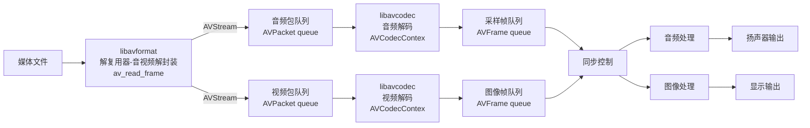
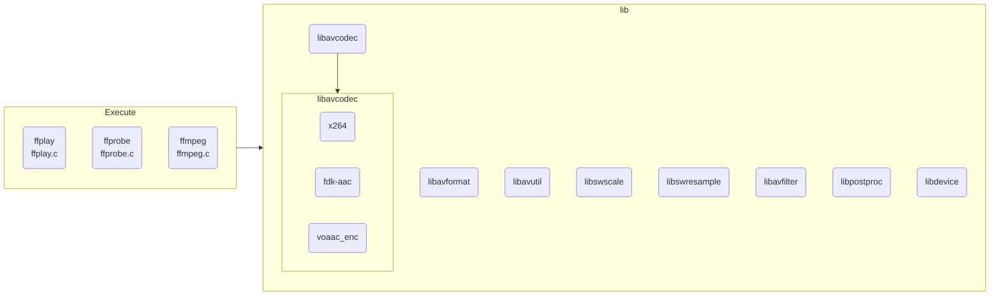

<!--
 * @Copyright: xvsos
 * @Author: xvs
 * @Date: 2022-02-09 16:19:36
 * @LastEditTime: 2022-02-09 22:03:47
 * @LastEditors: OsenbergQu
 * @FilePath: /av/contents/base_of_av_and_ffmpeg.md
 * @Description: 
-->
[TOC]
# 播放器框架


# 常用概念
+ 容器/文件(Container/File): 特定格式的多媒体文件，比如 mp4、flv、mkv等
- 媒体流(Stream): 表示时间轴上的一段连续数据，如一段声音数据、一段视频数据或字幕数据，可以是压缩的，也可以是非压缩的，压缩的数据需要关联特定的编解码器（有些码流音频是纯 PCM 数据）
+ 数据帧/数据包(Frame/Packet): 通常，一个媒体流是由大量数据帧组成的，对于压缩数据，帧对应着编解码器的最小处理单元，分属于不同媒体流的数据帧交错存储于容器中。
- 编解码器: 编解码器是以帧为单位实现压缩数据与原始数据之间的相互转换的。
+ 复用器
  ```mermaid
  flowchart LR
  A[音频流] --> 1(按一定的规则组合)
  B[视频流] --> 1
  C[字幕流] --> 1
  D[其他成分] --> 1
  1 --> E[视频文件]
  ```
- 解复用器
  ```mermaid
  flowchart LR
  1(按一定的规则拆分)
  E[视频文件] --> 1
  1 --> A[音频流]
  1 --> B[视频流]
  1 --> C[字幕流]
  1 --> D[其他成分]
  ```
  体现到 ffmpeg 中, 这部分功能在 libavformat 中实现
  + 编解码器
    **视频编解码器**
    ```mermaid
    flowchart LR
    A[图像 YUV 数据] --H264编码器--> B[H264帧]
    B --H264解码器--> A
    ```
    **音频编解码器**
    ```mermaid
    flowchart LR
    A[声音 PCM 数据] --ACC编码器--> B[ACC帧]
    B --ACC解码器--> A
    ```
  体现到 ffmpeg 中, 这部分功能在 libavcodec 中实现

# FFMPEG 库总览
## 整体架构

## 常用库介绍
> ffmpeg 常用库有 8 个
+ **libavutil:** 核心工具库，下面的许多其他模块都会依赖该库做一些基本的音视频操作
- **libavformat:** 文件格式和协议库，该模块是最重要的模块之一， 封装了 protocol 层和 demuxer、muxer 层， 使得格式和协议对于开发者来说是透明的。
+ **libavcodec:** 编解码库, 封装了 codec 层，但有一些 codec 是有自己的 license 的， 所以 ffmpeg 不会默认添加像 libx264、fdk-acc 等这些库的， 但 ffmpeg 就像一个平台一样， 可以将其他的第三方的 codec 以插件的形式添加进来， 然后为开发者提供统一的接口。
- **libavfilter:** 音视频滤镜库，该模块提供了包括音频特效和视频特效的处理，在使用 ffmpeg 的 API 进行编解码的过程中，直接使用该模块为音视频数据做特效处理是非常方便同时也非常高效的一种方式。
+ **libavdevice:** 输入输出设备库，比如，需要编译出播放声音或者视频的工具 ffplay，就需要确保该模块是打开的，同时也需要 SDL 的预先编译， 因为该设备模块播放声音与播放视频使用的都是 SDK 库。
- **libswresample:** 该模块可用于音频重采样，可以对数字音频进行声道数、数据格式、采样率等多种基本信息的转换。
+ **libswscale:** 该模块是将图像进行格式转换的模块，比如，可以将 YUV 的数据转换为 RGB 的数据，缩放尺寸由 1280x720 变为 800x480。
- **libpostproc:** 该模块可用于进行后期处理， 当我们使用 libavfilter 的时候需要打开该模块的开关，因为 filter 中会u使用到该模块的一些基础函数。
